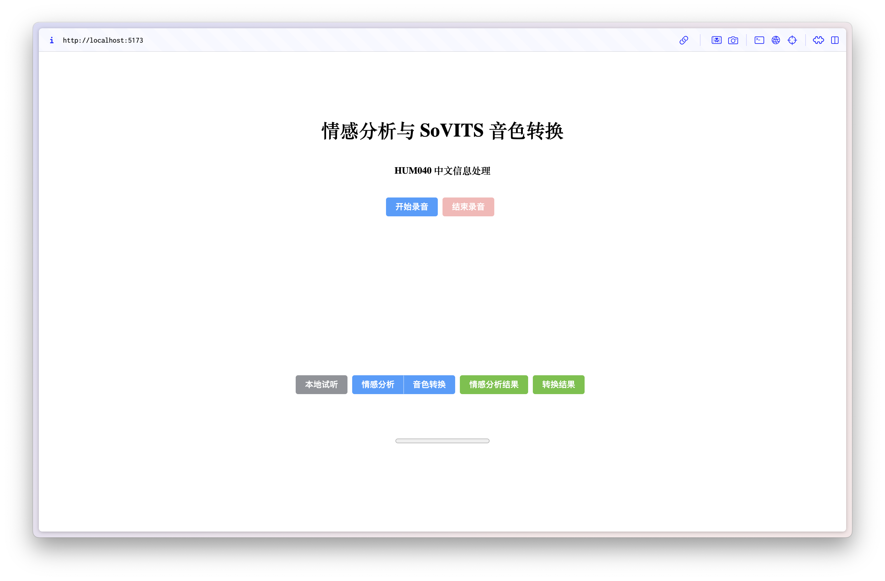

# SUSTech-HUM040-Voice-Changer

[English](README.md) | [简体中文](README_cn.md)

## 介绍

Github: [squarezhong/SUSTech-HUM040-Voice-Changer](https://github.com/squarezhong/SUSTech-HUM040-Voice-Changer)

这是南方科技大学 HUM040（中文信息处理）课程的项目。

你可以录制自己的声音，然后进行情感分析和音色转换。



### 情感分析
- 模型: [xmj2002/hubert-base-ch-speech-emotion-recognition](https://huggingface.co/xmj2002/hubert-base-ch-speech-emotion-recognition)

### 语音转换
ASR + VC
- ASR: [openai/whispering-small](https://huggingface.co/openai/whisper-small)
- VC: [huangxu1991/GPT-SoVITS-VC](https://github.com/huangxu1991/GPT-SoVITS-VC)

## 使用方法

确保前端和后端同时运行。

### 前端

确保你已经安装了 Node.js 和 npm。

```bash
cd frontend
npm install
npm run build
npm run dev
```

访问控制台显示的网站。

**请允许浏览器访问麦克风。**

### 后端

你可以参考 "backend/example.py" 文件编写你自己的后端。

```bash
# 安装 transformers
pip install transformers
# 安装 speechbrain
pip install speechbrain
# 如果没有 flask 和 flask-cors
pip install flask flask-cors
cd backend
# 修改为确切的文件名
python example.py
```

语音转换的实现非常荒谬，**不推荐**使用它。

如果你真的想使用，请参考以下步骤。

1. 在后端目录中克隆 [GPT-SoVITS-VC](https://github.com/huangxu1991/GPT-SoVITS-VC) 仓库。
2. 按照仓库中的说明安装依赖并下载预训练模型。
3. 在 `GPT-SoVITS-VC` 目录中添加一个空的 `__init__.py` 文件。
4. 将 `vc_nogui_bak.py` 文件复制到 `GPT-SoVITS-VC` 目录并重命名为 `vc_nogui.py`。
5. 启动后端服务器。

你可以用你想要的音频文件（**在3到10秒之间**）替换“sample.py”。

## 开发

Fork 本仓库，添加你的代码，并提交 pull request。

### 情感分析

### GPT-SoVITS 语音转换

官方版本的 [GPT-SoVITS](https://github.com/RVC-Boss/GPT-SoVITS) 尚未发布语音转换功能。因此，我们使用了一个已经实现该功能的 [fork](https://github.com/huangxu1991/GPT-SoVITS-VC)。

你可以帮助开发上述项目或等待他们的更新。

强烈不推荐参考 example.py 中的代码用于语音转换部分，因为其实现非常不合理，仅用于演示目的。

GPT-SoVITS-VC 自带 WebUI，但由于我希望在前端页面上同时使用情感分析和语音转换，我选择通过调用 Python 函数实现。

为了方便，我没有从头开始编写，而是修改了 vc_webui.py（本质上只是删除了与 Gradio 接口相关的代码），相当于复制了 Gradio 接口中“开始推理”按钮对应的功能。

## 参考
1. [RVC-Boss/GPT-SoVITS](https://github.com/RVC-Boss/GPT-SoVITS)
2. [huangxu1991/GPT-SoVITS-VC](https://github.com/huangxu1991/GPT-SoVITS-VC)

## 贡献者

感谢所有贡献者让这个项目得以存在。

<a href="https://github.com/squarezhong/SUSTech-HUM040-Voice-Changer/graphs/contributors">
  
</a>

## 许可证
[Apache License 2.0](LICENSE)